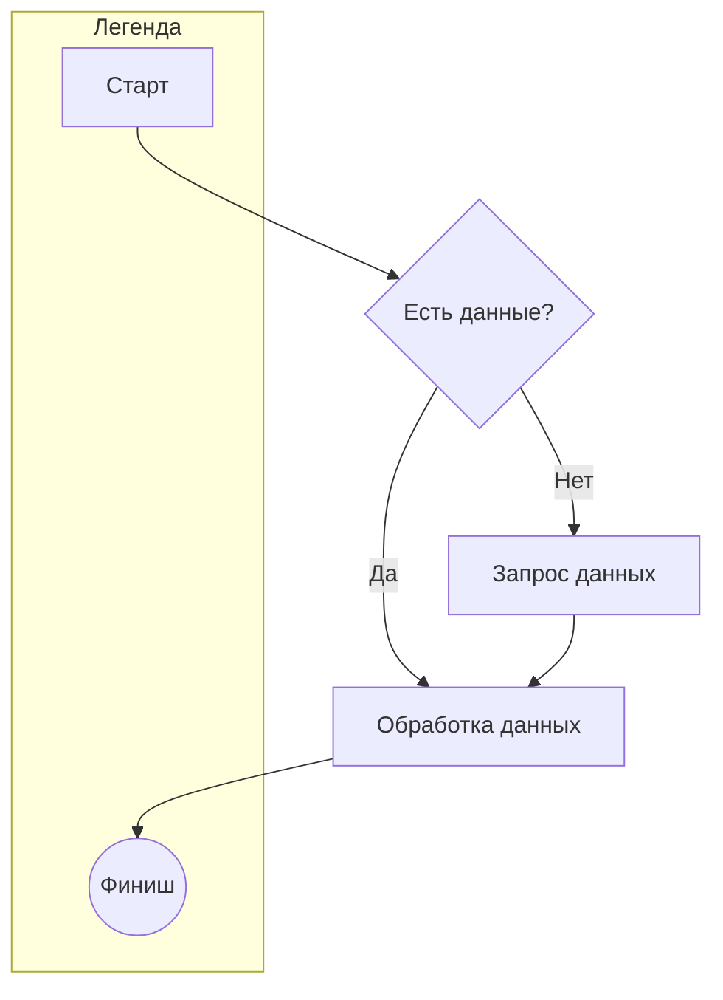
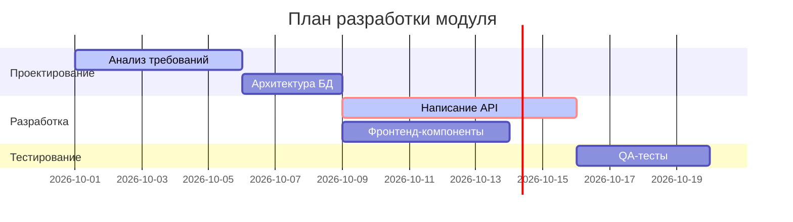
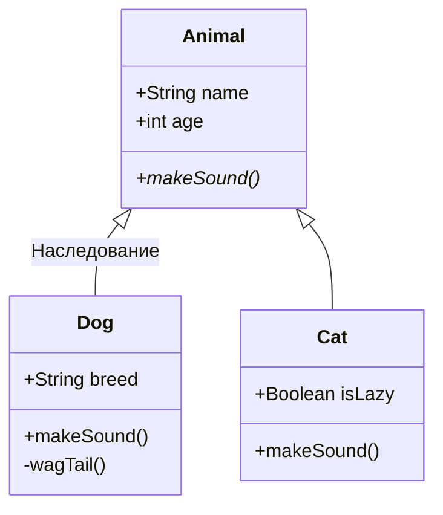
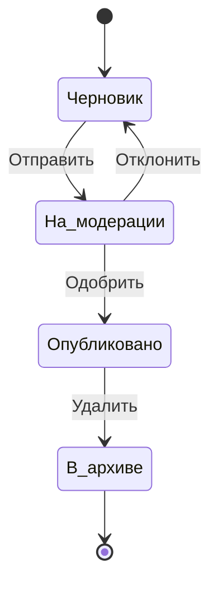
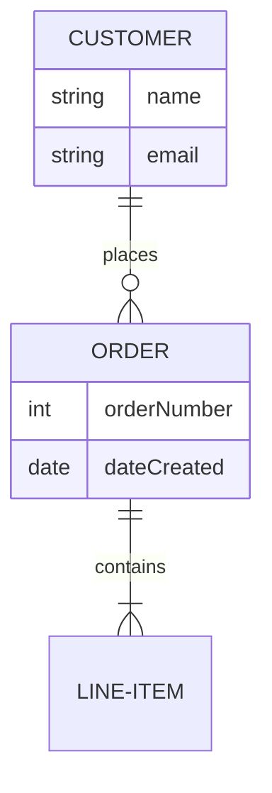
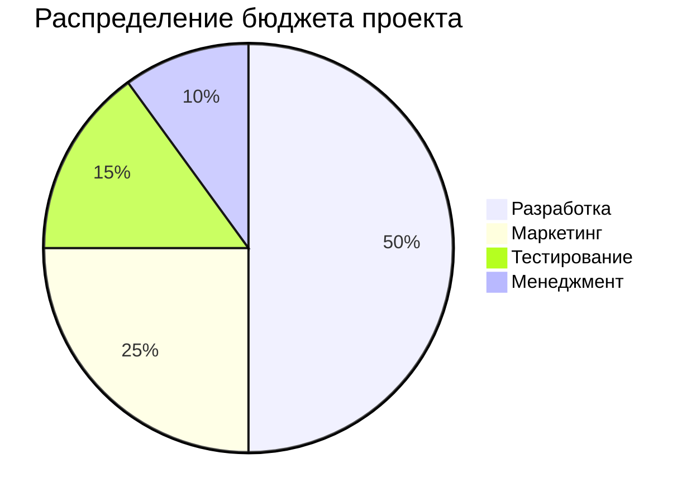
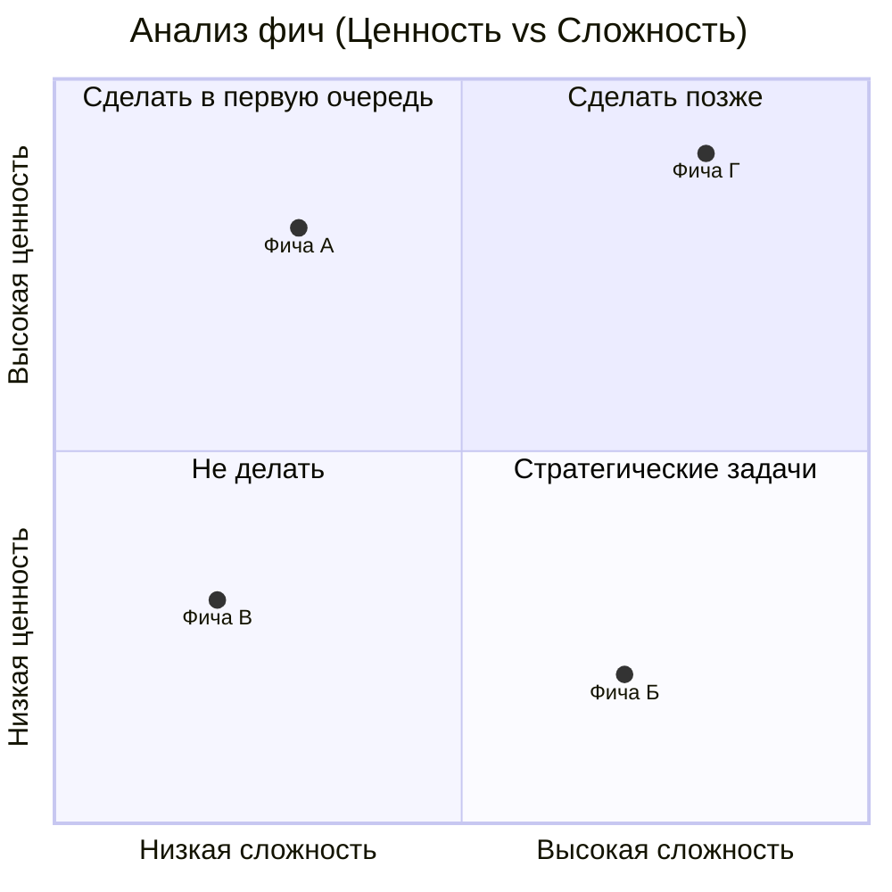
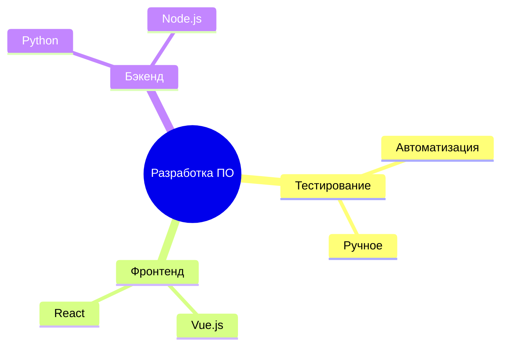
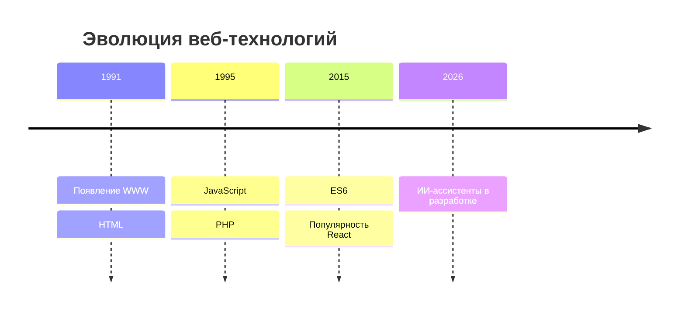

# Примеры диаграмм и графиков Mermaid для VS Code

В этом файле собраны основные типы диаграмм, которые поддерживает встроенный плагин Markdown / Mermaid в VS Code.

## 1. Блок-схема (Flowchart)
Используется для визуализации алгоритмов, бизнес-процессов и логических цепочек.



## 2. Диаграмма последовательности (Sequence Diagram)
Отлично подходит для отображения взаимодействия между объектами или микросервисами во времени.

```mermaid
sequence diagram
    autonumber
    Клиент->>Сервер: API-запрос (Данные формы)
    activate Сервер
    Сервер->>База Данных: SELECT * FROM users
    activate База Данных
    База Данных-->>Сервер: Результат выборки
    deactivate База Данных
    Сервер-->>Клиент: HTTP 200 OK (JSON)
    deactivate Сервер
```

## 3. Диаграмма Ганта (Gantt Chart)
Используется для управления проектами и планирования задач по времени.



## 4. Класс-диаграмма (Class Diagram)
Полезна для объектно-ориентированного проектирования и архитектуры кода.



## 5. Диаграмма состояний (State Diagram)
Показывает жизненный цикл объекта или системы и переходы между состояниями.



## 6. Диаграмма сущностей и связей (ER-Diagram)
Используется для проектирования схем баз данных.



## 7. Круговая диаграмма (Pie Chart)
Простой способ показать процентное соотношение долей.



## 8. Квадрант-графы (Quadrant Chart)
Используется для матричного анализа (например, важность/срочность).



## 9. Ментальная карта (Mindmap)
Позволяет структурировать идеи или дерево категорий.



## 10. Хронология / Таймлайн (Timeline)
Отличный инструмент для отображения исторических событий или дорожных карт.


